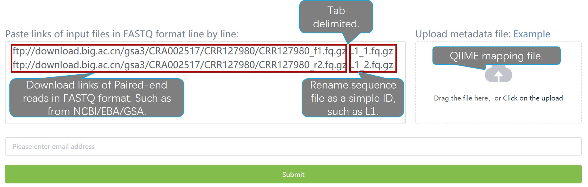
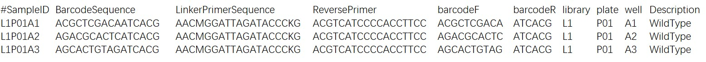

```{r setup, include=FALSE}
knitr::opts_chunk$set(echo = TRUE)
```

## Overview of input files



## Example mapping file and guideline


Instructions for filling in each column

1.	\#SampleID: Well ID, format is column library + plate + well. Must be start with alphabet.

2.	BarcodeSequence: Well barcode (barcodeF) + Plate barcode (barcodeR), diagram in figure 1.

3.	LinkerPrimerSequence: Forward primer, such as ACGTCATCCCCACCTTCC (799F).

4.	ReversePrimer: Forward primer, such as ACGTCATCCCCACCTTCC (1193R).

5.	barcodeF：Well barcode, according to Supplementary table 1.

6.	barcodeR：Plate barcode, according to Supplementary table 1.

7.	library: ID of library, format is alphabet+number, such as L1/L2.

8.	plate: Plate ID, three characters, such as P01/P02…P48.

9.	well: Well ID, from A1, A2, …  H12.

10.	Description: Must contained column at the end, but the content can fill anything.

## [Returen to homepage](http://bailab.genetics.ac.cn/culturome)

